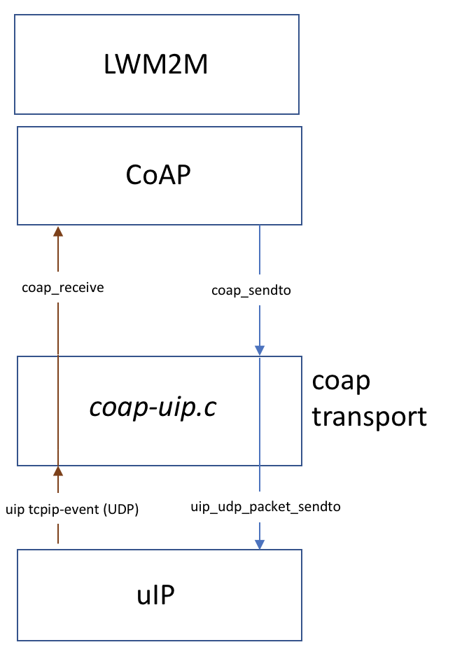
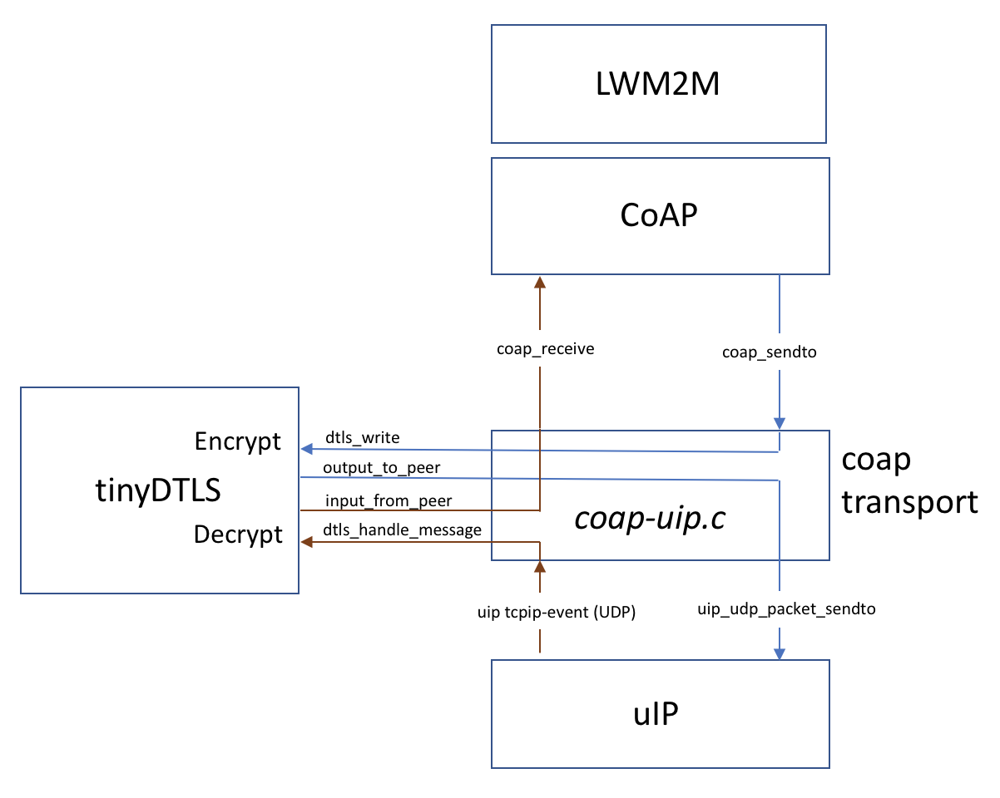

# CoAP

## About CoAP
CoAP is an application-layer protocol similar to HTTP but is transported over UDP instead of TCP. CoAP is 
defined in [RFC 7252]. It is implemented under `/os/net/app-layer/coap`. As CoAP is designed to be used over UDP it can not by itself use very large messages unless using block  transfer - this feature is specified in [RFC 7959]. Block transfer basically simulates TCP by fragmenting large data sets into multiple pieces and as CoAP supports confirmable messages (where messages are responded with an ACK) you can reliably transfer larger datasets than what can be fit in one single CoAP message. 

## CoAP in Contiki-NG
The Contiki-NG CoAP implementation is based on the Erbium implementation by Mattias Kovatsch but have been refactored to make it easier to port. 

### Main parts of the CoAP implementation
* CoAP Engine - The main CoAP receive and resource handler module. All CoAP resources are registered with the CoAP Engine via `void coap_activate_resource(coap_resource_t *resource, const char *path)`. More complex resource handlers are also registered in the CoAP engine. A resource handler will get a call for all incoming CoAP messages and can either provide logging for all incoming messages or more complex services such as a complete LWM2M implementation. The Contiki-NG LWM2M implementation is based on this type of CoAP resource handler. The API for adding a handler is `coap_add_handler(coap_handler_t *handler)`.

* CoAP Handler - An API for implementing CoAP resource handler that takes care of incoming CoAP messages. The Contiki-NG LWM2M engine is an example of a CoAP Handler.

* CoAP Endpoint - An API for handling different kinds of CoAP endpoints. The Endpoint API supports connecting to an endpoint (a server) and checking if the endpoint is connected and if it is secure or not. The default endpoint implementation is based on uIP6 and handles both insecure and secure connections (CoAP and CoAPs).
The default implementation is in the file `coap-uip.c`.

* CoAP Transport - An API for handing over CoAP data from the CoAP stack to the transport protocol (default UDP). The CoAP implementation will call the function `coap_sendto(const coap_endpoint_t *ep, const uint8_t *data, uint16_t length)` to send CoAP messages.
The CoAP transport implementation hand over its incoming data to the CoAP stack via the API   `coap_receive(coap_endpoint_t *src_endpoint, uint8_t *data, uint16_t len);`. The default implementation is in `coap-uip.c`.

* CoAP Messages - CoAP messages are handled by the `coap.c` file. Functions for parsing and generating messages, etc.

* CoAP Timer - a timer API that provides timers for timeouts (retransmissions, etc) for the CoAP implementation. The default implementation is in `coap-timer-default.c` (using etimer to implement the timer).

The default implementation of CoAP transport in Contiki-NG use uIP for incoming/outgoing UDP packets. The secure version with DTLS integration is shown in the illustration below.

### Configuration
* Max size of CoAP messages is specified in `COAP_MAX_CHUNK_SIZE`, default 64.
* Max number of open transactions (e.g. sending a confirmable packet that needs to get an ACK) `COAP_MAX_OPEN_TRANSACTIONS`, default 4.
* Max number of observers, `COAP_MAX_OBSERVERS`, default 3 (or `COAP_MAX_OPEN_TRANSACTIONS` - 1)
* Using DTLS for encryption - MAKE_WITH_DTLS=1 when building the code.

## CoAPs - Secure CoAP
The default implementation of CoAP transport in Contiki-NG support both secure and non-secure CoAP. If you use Secure CoAP the transport will instead of just putting the packets straight into or receive from uip6 - go via TinyDTLS. For coap_sento it will use `dtls_write` instead of `uip_udp_packet_sendto` and on the receive side it will send in data using `dtls_handle_message` rather than using `coap_receive`. Later TinyDTLS will call `input_from_peer` with unencrypted data which is sent into the CoAP implementation using `coap_receive`.

The integration of DTLS in CoAP.

### Limitations
- Dedicated Observe buffers
- Optimize message struct variable access (directly access struct without copying)
- Observe client
- Multiple If-Match ETags
- (Message deduplication)

### Changes 4.0 -> 4.1
- Refactored CoAP framework to remove the REST engine codebase and to make CoAP easier to port to other operating systems and enable running "standalone".
- Added support for TinyDTLS (as a submodule)
- `COAP_MAX_CHUNK_SIZE` is used instead of the old `REST_MAX_CHUNK_SIZE` as this is now a pure CoAP implementation 
and not a generic REST server/client framework.

## Usage

Check out:
* A CoAP tutorial: [tutorial:coap]
* A [LWM2M][doc:lwm2m] (which builds on top of CoAP) tutorial: [tutorial:lwm2m]

[tutorial:coap]:/doc/tutorials/CoAP
[tutorial:lwm2m]:/doc/tutorials/LWM2M-and-IPSO-Objects
[doc:lwm2m]:/doc/programming/LWM2M
[RFC 7252]: https://tools.ietf.org/html/rfc7252
[RFC 7959]: https://tools.ietf.org/html/rfc72959
