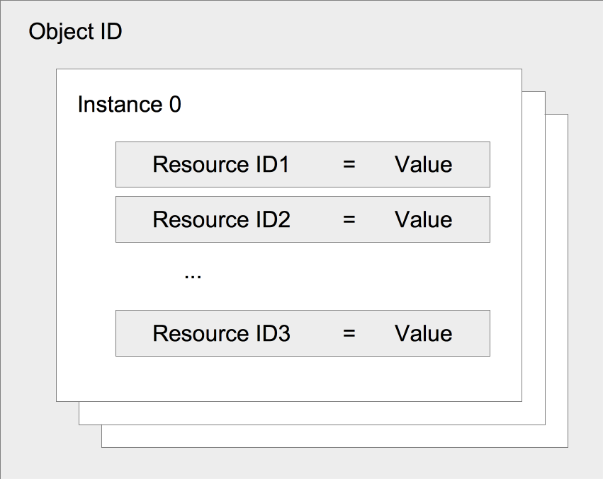
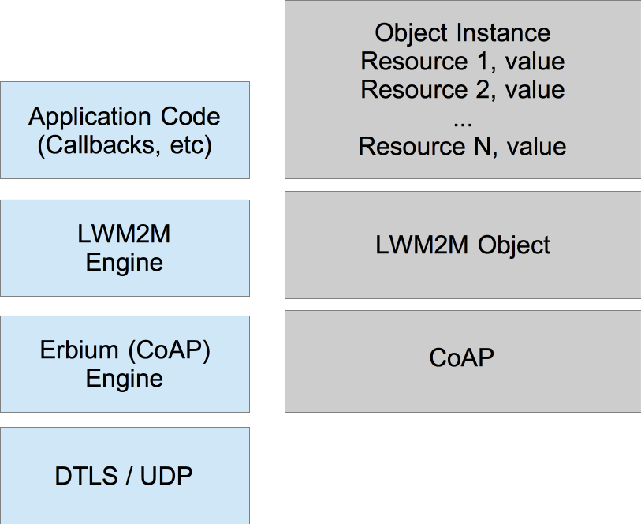

# LWM2M

## OMA Lightweight M2M and IPSO Smart Objects

OMA has defined a standard for IoT or M2M devices, building on CoAP (and DTLS). It defines bootstrap and device management, as well as an object model. On top of LWM2M, the IPSO Alliance has defined a set of IPSO Smart Objects that describe common sensors and actuators.



Each object in LWM2M has a 16-bit object id that is unique and each object can have one or multiple instances. Each of the instances also have a 16-bit id that is set when creating the instance. Each of
the instances have a number of resources defined by the object's type (object id). Resources also have a 16-bit id that is unique - each resource is of a specific type and OMA allow ints, floats, string and opaque byte arrays. OMA LWM2M defines a set of objects such as security object with security related information, server object that describe LWM2M servers - both these are typically written during the bootstrap process. Then there are objects for access control, firmware upgrade, network/connection monitoring and other management related things.

### LWM2M in Contiki-NG
In the Contik-NG we have developed a OMA LWM2M implementation on top of Erbium CoAP engine. It supports bootstrapping and works with both [Leshan](https://www.eclipse.org/leshan/) and [Wakaama LWM2M](https://www.eclipse.org/wakaama/) servers. The current implementation supports TLV and JSON data format for the objects.



The illustration show the LWM2M data object to the right and the implementation modules to the left. The object instance data is resource values. These can either be constants or the can be variables or callbacks if there is processing needed to create the value (sensor reading, etc). There are callbacks for all the LWM2M operations: read, write and execute.

### Creating an IPSO Object
Using the LWM2M engine and the IPSO object support it is fairly easy to create a new IPSO Object. The implementation is partly code that is used for reading out data values or setting control values or configurations. The other part is a section that set-up the data model for the object. This section is setting values in a IPSO sensor or control struct.

An example of a temperature sensor could look like:

```
IPSO_SENSOR(temp_sensor, 3303, read_temp_value,`
              `.max_range = 100000, /* 100 cel milli celcius */`
              `.min_range = -10000, /* -10 cel milli celcius */`
              `.unit = "Cel",`
              `.update_interval = 30`
              `);
```

Where the first argument is the name of the sensor, then the LWM2M object ID
- in this case 3303, followed by the function to call when reading out the data
and finally max, min range and unit type. After this is defined you will need
to have a function providing the temperature data.

This looks like the following snippet:

```c
static lwm2m_status_t
read_temp_value(const ipso_sensor_t *s, int32_t *value)
{
  *value = 10 * hdc_1000_sensor.value(HDC_1000_SENSOR_TYPE_TEMP);
  return LWM2M_STATUS_OK;
}
```

This examples reads out the temperature value from a HDC_1000 sensor which is
available on the CC2650 SensorTag. The value in this case should be in milli
Celsius but comes from the driver in percent so it is multiplied by 10 to get
milli Celsius.

The final piece of code needed to set this sensor up is to call an add function
to add this LWM2M object into the LWM2M engine. 

```c
ipso_sensor_add(&temp_sensor);
```

Read the LWM2M and IPSO object tutorial for instructions on how to test LWM2M at:
[LWM2M and IPSO Object Tutorial](/doc/tutorials/LWM2M-and-IPSO-Objects)
