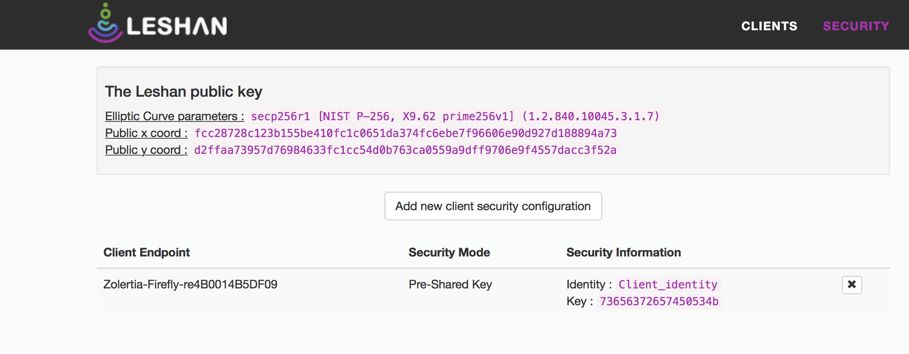

# LWM2M and IPSO Objects

To make an application with LWM2M and IPSO Objects functionality you can start from the example: `examples/lwm2m-ipso-objects/example-ipso-objects.c`. You will also need a LWM2M server. You can run a Leshan LWM2M server on your computer, or you can use one that is publicly available.

## Example IPSO objects LWM2M client
Firstly, make sure that the `example-ipso-objects` example is configured with the correct server address. 
By default, the example will assume the LWM2M server's address is `fd00::1`.

In most cases you will not need to change this address (details later on in this page), but if you do need to change it, define `LWM2M_SERVER_ADDRESS` in the `project-conf.h` file:
```c
#define LWM2M_SERVER_ADDRESS "coap://[fd00::1]"
```

### For platform native
You can now build this example for the native platform and run it:
```bash
$ make TARGET=native
$ sudo ./example-ipso-objects.native 
```

When this process starts, it will create a virtual tunnel interface `tun0`. It will then register with the default LWM2M server address: `fd00::1`, which is the address of the `tun0` interface.

If you run the Leshan LWM2M server on the same computer things should just work. If you run the Leshan server in some other computer, or if you use a public server, then you will need to set the correct server address in the `example-ipso-objects` example as described above.

### For a wireless embedded device
You can also use this example on most Contiki-NG wireless embedded platforms, for instance on the TI Sensortag, as follows:
```bash
$ make TARGET=cc26x0-cc13x0 BOARD=sensortag/cc2650 example-ipso-objects
```

Then, program your device with the firmware (see documentation of the platform you are using).

In order to get anything to happen you will need to setup a 6LoWPAN network with a border-router on a prefix and interface address, such as `fd00::1/64` (see [tutorial:rpl-br]).

If you are running the LWM2M server on the same computer where you have the border router attached and if the border router's interface address is the default then things should again just work. If you have specified a different address for the `tun0` interface, then you will need to use that address as the server address in the `example-ipso-objects` example as described above.

Another option is to set up a globally routable IPv6 network so that you can register with any IPv6 enabled LWM2M server.

## LWM2M Server
In all of the above scenarios, you will also need a LWM2M server. You can run one on your own computer or use one that is publicly available

### On your computer
Make sure that your LWM2M server is started and is listening on the address assigned to the `tun0` interface (the tun interface corresponding to the 6LoWPAN network). This will have been created by either the native LWM2M client process or by `tunslip6`). To setup and run a Leshan LWM2M server on your computer try this:
```bash
$ wget https://hudson.eclipse.org/leshan/job/leshan/lastSuccessfulBuild/artifact/leshan-server-demo.jar
$ java -jar ./leshan-server-demo.jar
```

**On macOS:**

If you are running the Leshan server on macOS you may need to specify additional parameters:

```
java -jar ./leshan-server-demo.jar -lh <tun0 IPv6 address> -slh <tun0 IPv6 address>
```
In the typical scenario discussed above, `<tun0 IPv6 address>` will be `fd00::1`

To access the demo server go to http://localhost:8080 and you should see the registration page of the Leshan server.
If everything is set up correctly, your device should show up on the Leshan server's device list.

### Registering with global LWM2M server via NAT64
If you like to register with the demo server at Eclipse you can change the registration address in the code to the NAT64 format. Note: this requires your 6LoWPAN border router to have a NAT64 running on the same network (so that the IPv6 address is converted into an IPv4 address). You can use the Jool NAT64 for that (see [doc:ip64]).

```c
#define LWM2M_SERVER_ADDRESS "coap://[64:ff9b::527:53ce]"
```

When you run a successful registration here you should see your device at the URL:
http://leshan.eclipse.org

## LWM2M with DTLS (pre-shared keys)

Contiki-NG's LWM2M implementation supports DTLS, to secure the communication with the registration server in LWM2M.
First some small changes in the configuration are needed.
Add the following to the project-conf.h:
```c
#define LWM2M_SERVER_ADDRESS           "coaps://[fd00::1]"
#define COAP_DTLS_PSK_DEFAULT_IDENTITY "Client_identity"
#define COAP_DTLS_PSK_DEFAULT_KEY      "secretPSK"
```

This will change the registration to secure mode as it is CoAPs in the URI and identity and pre-shared key for DTLS is defined. The key needs to be entered in Leshan as hexadecimal - "secretPSK" is "73656372657450534b" in hex.

Then do a distclean:
```bash
$ make distclean
```

Followed by:

```bash
$ make TARGET=zoul BOARD=firefly-reva MAKE_WITH_DTLS=1 MAKE_COAP_DTLS_KEYSTORE=MAKE_COAP_DTLS_KEYSTORE_SIMPLE example-ipso-objects.upload
```

If you did not already setup a Leshan server and a 6LoWPAN border-router, do that (description above) and
configure the same security Identity and keys in the Leshan server. Remember to take note of the registration endpoint so that you can get the correct name on that in the security configuration in Leshan. If you are using a Zolertia firefly it might look like the following:



Note: if you do not know the endpoint name you can run in non-secure mode first to see the name of the endpoint.

### Bootstrapping
This tutorial describe how to setup a LWM2M client registering to a server with all security keys (or none)
configured beforehand. LWM2M also offers a bootstrap option where the node first contacts a local server, and from there, obtain the server to actually register with. When bootstrapping the bootstrap server can also set the security keys that should be used for the other server connection.
To enable bootstrapping in the Contiki-NG LWM2M client, set the following flag:
```c
#define REGISTER_WITH_LWM2M_BOOTSTRAP_SERVER 1
```

### References
Here are some references to used standards and LWM2M servers.

* [OMA LWM2M](http://technical.openmobilealliance.org/Technical/technical-information/release-program/current-releases/oma-lightweightm2m-v1-0)
* [IPSO Smart Object Guidelines](http://www.ipso-alliance.org/smart-object-guidelines)
* [Wakaama LWM2M Server](https://github.com/eclipse/wakaama)
* [Leshan LWM2M Server](https://github.com/eclipse/leshan)

[tutorial:rpl-br]: /doc/tutorials/RPL-border-router
[doc:ip64]: /doc/getting-started/NAT64-for-Contiki-NG
